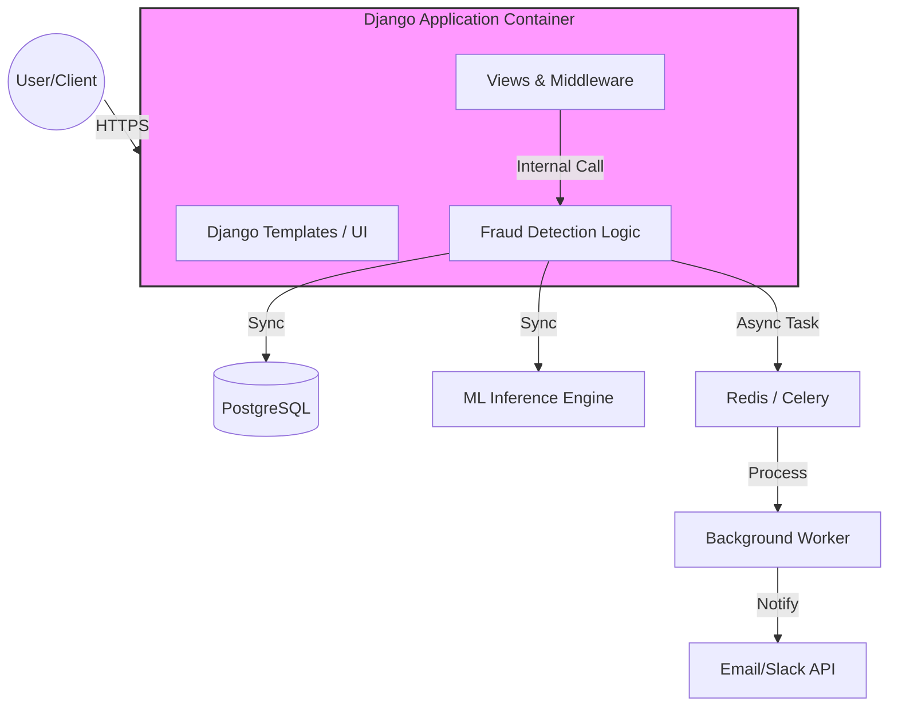

[Vigilant Pay]
>   A high-performing real-time api protection tool.
>   The application uses MVC architecture because velocity was important for the development. MVC
    increased the development speed, ease of test and deployment.

[](https://github.com)
[](https://python.org)
[](https://djangoproject.com)

## 🚀 Highlights
*   **Scalable Architecture**:  Monolithic architecture using Django Framework for server-side rendered
                                appplication to enable rapid development and simplified state management.
                                
                                Full-stack integration by integrating fraud scoring logic directly into the request-response lifecycle using Django signals and middleware.
*   **Security First**:         Implements MFA authentication.

## 🛠 Tech Stack
*   **Backend**:    Django, PostgreSQL
*   **Frontend**:   TypeScript, Django-Plotly Dash

## ⚙️ Local Development
### Prerequisites
*   Docker & Docker Compose (Recommended)
*   Python 3.13+

### Setup
1.  **Clone & Environment**:
    ```bash
    git clone [repo-url]
    cp .env.example .env # configure your secrets here
    ```

2.  **Run with Docker (Standard for Senior Profiles)**:
    ```bash
    docker-compose up --build
    ```

3.  **Database Setup**:
    ```bash
    docker-compose exec web python manage.py migrate
    docker-compose exec web python manage.py createsuperuser

The application will be live at `http://localhost:8000

## 🏗 Sytem Architecture


## 📄 License
Distributed under the MIT License. See `LICENSE` for more information.

